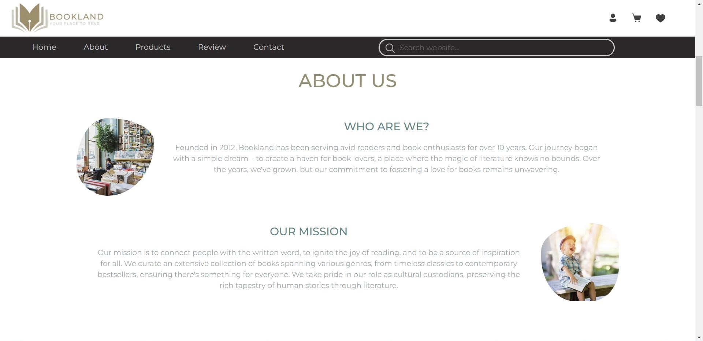
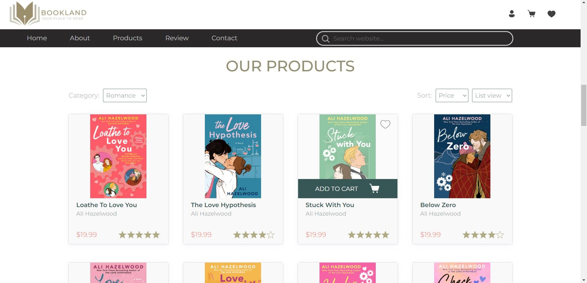
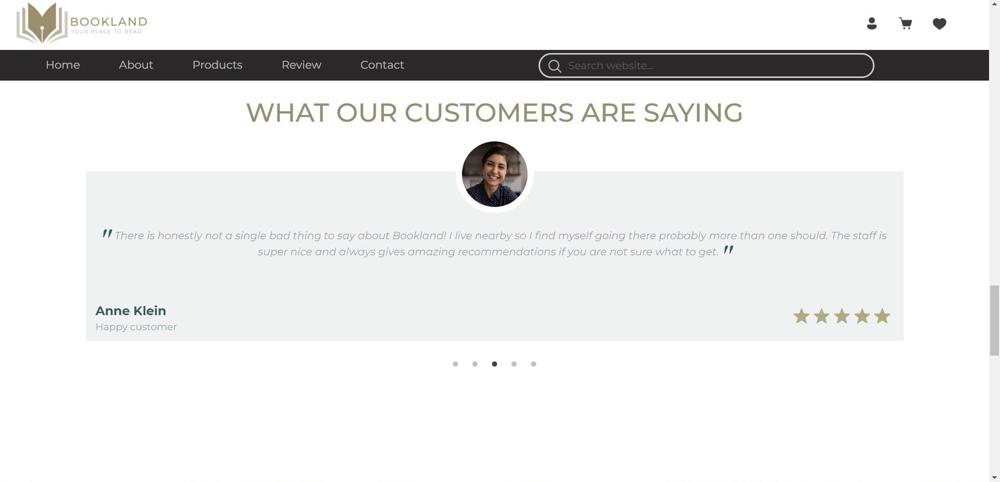
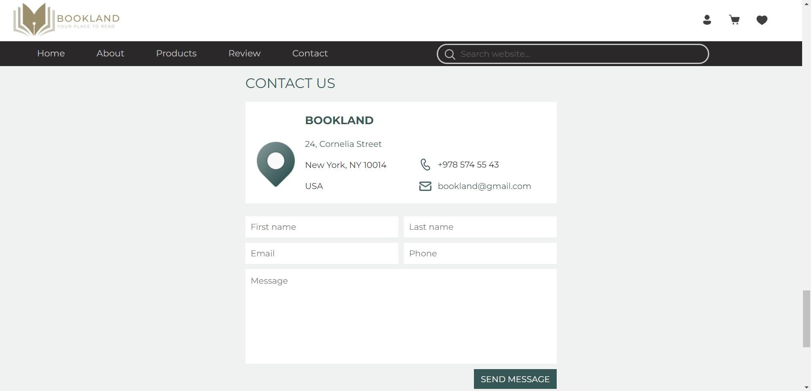
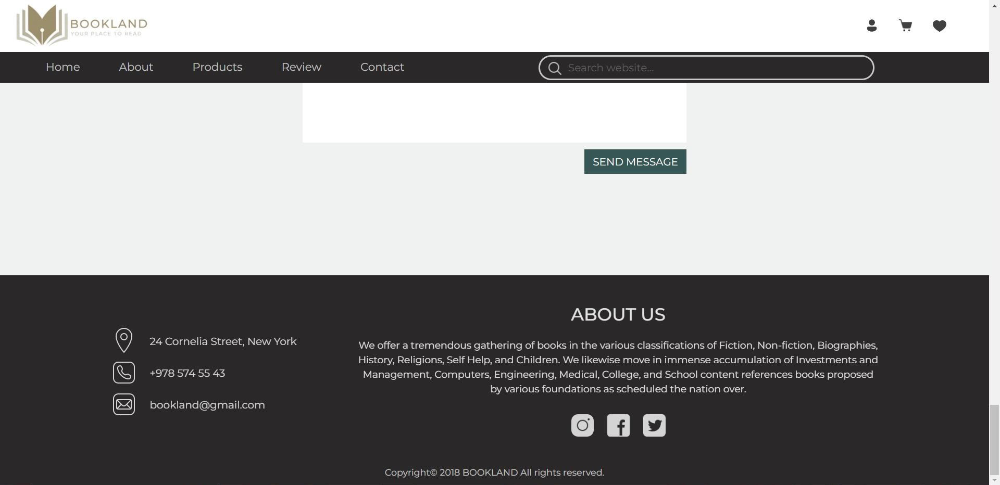
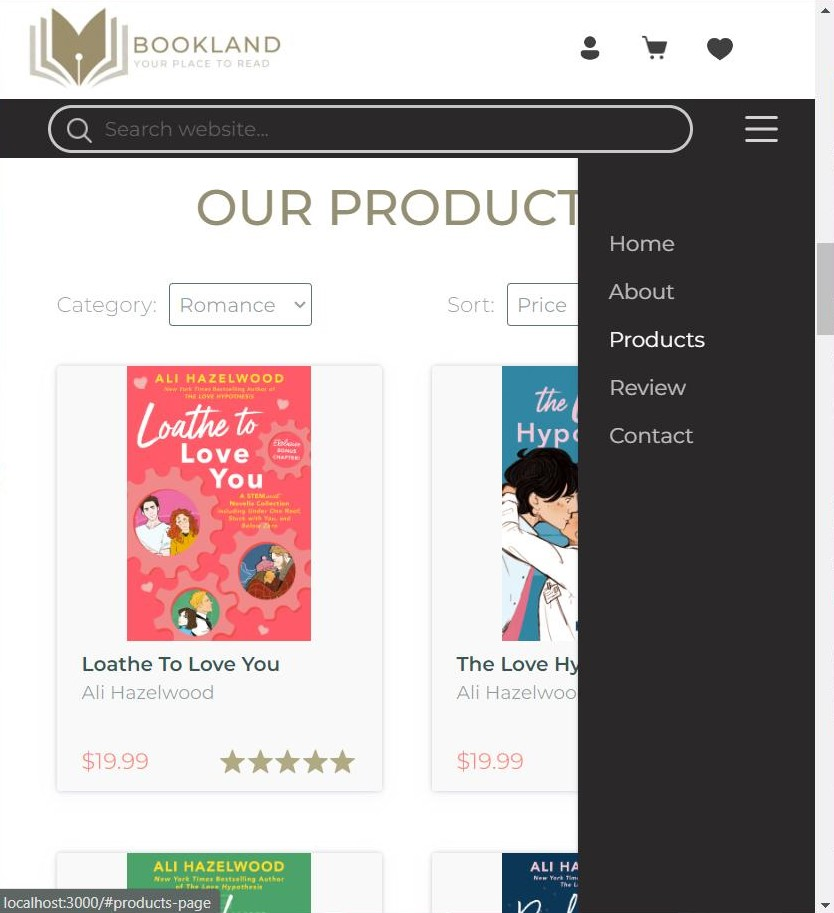
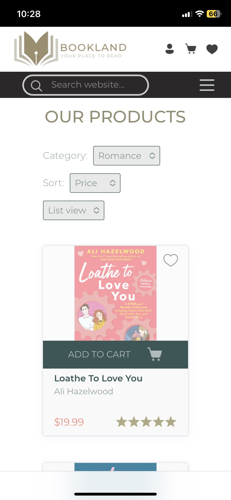
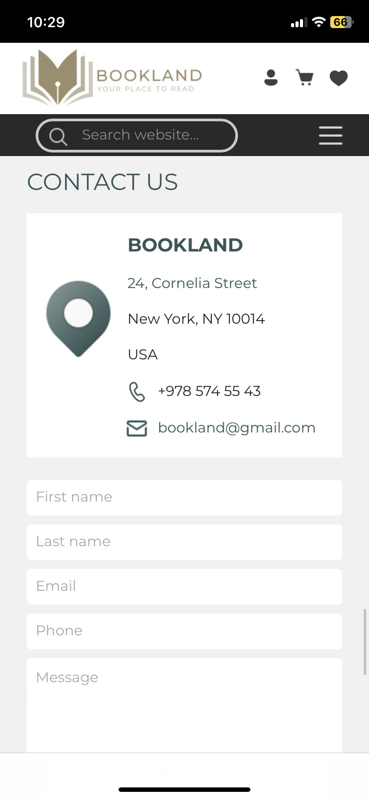
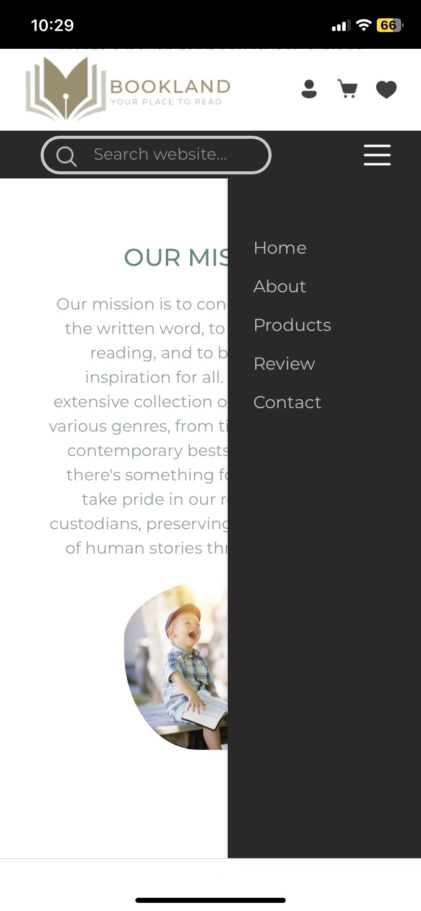

<p align="center">
  
</p>
<h1 align='center'>Bookland</h1>

# About
This repository contains the frontend of a website I'm currently working on. It was made in JavaScript using React and is fully responsive. Backend coming soon...

# 📚Bookland
Bookland is a fictional bookstore that offers all different kinds of books, as well as meet & greet's with your favourite authors, book signings, group readings and much more.
The website provides:

- an insight to all of the latest discounts and events through an automatic news slider on the home page
- an online shop
- customer ratings review
- contact information with the option of contacting the company directly through a simple contact form
- the option of creating an account which allows users to add available items to wishlist as well as leave their ratings on the company

# App gallery

## 🖥Desktop screen

| | |
|:-------------------------:|:-------------------------:|
|||
|||
|||
|| 

## 📱Mobile screen

| | | |
|:-------------------------:|:-------------------------:|:-------------------------:|
||||
||||
||  

# 🔧Instalation
1. Download the project or clone the repository by running the following command:
```
gh repo clone nkokor/Bookland
```
1. Install the dependencies by running:
```
npm install
```
3. Start the application using:
```
npm start
```

# ⚙Requirements

Node, React


